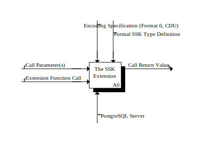

# SSK Architecture Guide

**For Contributors and Technical Architects**

This document integrates the dual IDEF0 concern models—[Project Concerns](PROJECT_CONCERNS.md) and [Implementation Concerns](IMPLEMENTATION_CONCERNS.md)—into practical guidance for contributors working on the SSK codebase.

---

## Quick Navigation

- **[Project Concerns Model](PROJECT_CONCERNS.md)** — Strategic scope and governance (PRJ/A0-A5)
- **[Implementation Concerns Model](IMPLEMENTATION_CONCERNS.md)** — Technical decomposition (IMP/A0-A3)
- **[Specification](SPECIFICATION.md)** — Formal SSK semantics and Format 0
- **[Introduction](SSK_INTRO.md)** — Conceptual overview

---

## Understanding the Dual Models

SSK is governed by two complementary IDEF0 models, each addressing a different class of concern:

### Project Concerns (PRJ)

**What**: Strategic and governance concerns  
**Audience**: Project maintainers, strategic decision-makers, adopters  
**Activities**: Formulation → Exposition → Implementation → Expansion → Vitalisation  
**Focus**: *Why* SSK exists and *what* it provides

[→ Full Project Concerns Model](PROJECT_CONCERNS.md)

---

### Implementation Concerns (IMP)

**What**: Technical decomposition of the extension  
**Audience**: Contributors, developers, code reviewers  
**Activities**: Value Decoder → Function Processor → Value Encoder  
**Focus**: *How* SSK is implemented

[→ Full Implementation Concerns Model](IMPLEMENTATION_CONCERNS.md)

---

## A0 Context Diagrams: The Models

Each concern model defines its scope through an A0 (context) diagram, which then decomposes into detailed activities:

### Project Concerns A0: Strategic Scope

The top-level context diagram for project-level concerns:


The A0 decomposes into five strategic activities:
- **Formulation** — Bijection concept and theory
- **Exposition** — Communication and education
- **Implementation** — Core realization
- **Expansion** — Scale engineering
- **Vitalisation** — Future growth

[→ Full Project Concerns Model](PROJECT_CONCERNS.md)

---

### Implementation Concerns A0: Technical Scope

The top-level context diagram for implementation-level concerns:



The A0 decomposes into three technical activities:
- **Value Decoder** — Parsing subset data from Format 0
- **Function Processor** — Set operations
- **Value Encoder** — Serializing subset data to Format 0

[→ Full Implementation Concerns Model](IMPLEMENTATION_CONCERNS.md)

---

## The Critical Distinction

**Most code lives in PRJ/A4 (Expansion: Preserving Semantics at BIGINT Scale)**  
**Most concept lives in PRJ/A1 (Formulation: The Bijection Affair)**

Do not conflate these. When you're debugging a complex encoding issue, you're in A4 (engineering for scale). When you're explaining what SSK *is*, you're in A1 (the bijection concept).

---

## Source Code Mapping

### Implementation Concerns → Code

| IDEF0 Activity | Directory | Purpose | Key Files |
|----------------|-----------|---------|-----------|
| **IMP/A0** | `src/udt/` | PostgreSQL integration | Type definitions, I/O functions |
| **IMP/A1** Decoder | `src/codec/` | Value decoding | `decode.c`, Format 0 parsing |
| **IMP/A11-A14** | `src/keystore/` | AbV caching | Cache management |
| **IMP/A2** Processor | *Distributed* | Set operations | Needs consolidation |
| **IMP/A21** | `src/agg/` | Aggregates | Aggregate function handlers |
| **IMP/A3** Encoder | `src/codec/` | Value encoding | `encode.c`, CDU serialization |
| **CDU** (Mechanism) | `src/codec/`, `include/cdu.h` | Variable-length encoding | Canonical Data Unit |
| **Format 0** (Control) | `include/ssk_format.h` | Encoding specification | Hierarchical structure |

### Project Concerns → Artifacts

| IDEF0 Activity | Artifact Type | Location |
|----------------|---------------|----------|
| **PRJ/A1** Formulation | Formal definitions | `SPECIFICATION.md`, `SSK_INTRO.md` |
| **PRJ/A2** Exposition | Examples, tutorials | `README.md`, `examples/` |
| **PRJ/A3** Implementation | Core extension code | Early commits, `src/udt/` |
| **PRJ/A4** Expansion | Scale engineering | Most of `src/`, `include/` |
| **PRJ/A5** Vitalisation | Future directions | `TODO-LIST.md`, issues |

---

## Key Architectural Principles

### 1. Bijection is Everything

SSK is NOT compression, NOT hashing. It's a bijection:

- Same subset → identical bytes (always)
- Different subsets → different bytes (no collisions)
- Perfectly reversible (contains all subset information)

**Governed by**: PRJ/A1 (Formulation), enforced by IMP/A3 (Encoder canonical form)

### 2. Separation of Representation and Persistence

### 2. Abstract Bit Vector (AbV) as Representation Layer

**Definition:**
- **AbV (Abstract Bit Vector):** Logical construct representing subset membership—one bit per ID in the domain.
- **SSKDecoded:** Concrete C representation of the AbV. Its internal structure depends on domain and implementation:
  - **Trivial domain (IDs 1..64):** `SSKDecoded` = `uint64_t` — single 64-bit AbV (no hierarchy, pure and simple)
  - **Scale domain (IDs 1..2^64):** `SSKDecoded` = hierarchical struct with partitions → segments → chunks → tokens

**In code:** Variables and parameters use the name `abv` to denote actual AbV values. Always of type `SSKDecoded` (or `SSKDecoded*`), but the implementation swaps via `#ifdef TRIVIAL_IMPL`.

**Benefit:** 
- IMP/A1 (Decoder) and IMP/A3 (Encoder) manage the format boundary (bytes ↔ AbV)
- IMP/A2 (Processor) works only with AbV; never sees bytes
- Can evolve from trivial (uint64_t) to scale (hierarchy) without changing operation semantics
- Trivial implementation proves correctness; scale implementation proves scalability

### 3. Hierarchical Partitioning for Scale

Handles 2^64 domain through hierarchy (scale implementation only):

```
Partition (top level)
  └─ Segment
      └─ Chunk
          └─ Token (combinadic-compressed)
```

**Governed by**: Format 0 specification (control to IMP/A1/A3)  
**Implemented by**: PRJ/A4 (Expansion engineering)

### 4. Canonical Encoding

Every AbV has exactly ONE byte representation (bijection):

- Enforces bijection (same AbV → same bytes)
- Enables equality testing via byte comparison
- Requires normalization after operations

**Governed by**: Format 0 + CDU specifications  
**Implemented by**: IMP/A25 (Normalise), IMP/A31 (Encode AbV)

---

## Contributor Guidelines

### Before Modifying Code

1. **Identify your concern**:
   - Am I working on concept/semantics? → PRJ/A1 (rare, requires deep review)
   - Am I adding an example? → PRJ/A2 (documentation)
   - Am I fixing a bug? → PRJ/A4 or IMP/A1-A3 (identify which activity)
   - Am I optimizing performance? → PRJ/A4 and IMP/A1-A3 (identify impact)

2. **Understand the activity**:
   - Read the [relevant model document](IMPLEMENTATION_CONCERNS.md)
   - Identify inputs, outputs, controls, mechanisms
   - Check if changes cross activity boundaries

3. **Assess impact**:
   - Does this affect the bijection? (requires formal review)
   - Does this change the encoding? (breaks backward compatibility)
   - Does this change the API? (impacts users)

### Testing by Activity

| Activity | Test Strategy |
|----------|---------------|
| **IMP/A1** Decoder | Round-trip tests (encode → decode → verify), known-value tests |
| **IMP/A2** Processor | Operation semantics (union, intersection, etc.), idempotency, commutativity |
| **IMP/A3** Encoder | Canonical form tests (same AbV → same bytes), bijection tests |

### Code Review Checklist

- [ ] Changes properly scoped to identified activity
- [ ] Bijection property preserved (if applicable)
- [ ] Backward compatibility maintained (or version bump justified)
- [ ] Tests cover changed activity
- [ ] Documentation updated (if externally visible)
- [ ] IDEF0 reference in commit message (e.g., "Optimize IMP/A31 encoding")

---

## Common Patterns

### Adding a New Set Operation

**Affects**: IMP/A2 (Function Processor)  
**Steps**:
1. Define operation semantics (what it computes)
2. Implement in Function Processor (operates on AbV only)
3. Add to IMP/A21 (SSK/AGG Function Exec) routing
4. Test with various input sizes and fragmentation states
5. Ensure normalization (IMP/A25) is applied

**Does NOT affect**: IMP/A1 (Decoder) or IMP/A3 (Encoder)

### Optimizing Encoding Performance

**Affects**: IMP/A3 (Value Encoder)  
**Constraints**:
- MUST preserve canonical form (bijection requirement)
- MUST maintain Format 0 compliance
- Cannot break backward compatibility

**Steps**:
1. Profile to identify bottleneck
2. Optimize while maintaining CDU specification
3. Test round-trip (decode optimized → encode → verify identical bytes)
4. Benchmark against existing values

### Adding Format 1

**Affects**: IMP/A1 (Decoder) AND IMP/A3 (Encoder)  
**Complexity**: HIGH (crosses activity boundary, backward compatibility critical)

**Steps**:
1. Define Format 1 specification (new control)
2. Add version detection to IMP/A1
3. Implement Format 1 encoder in IMP/A3
4. Ensure both formats coexist
5. Provide migration path
6. Document compatibility matrix

---

## Debugging Guide

### Symptom: Wrong results from operations

**Likely Activity**: IMP/A2 (Function Processor)  
**Check**:
- Is normalization working? (IMP/A25)
- Are fragments being processed correctly? (IMP/A24)
- Is operation logic correct? (IMP/A21-A22)

### Symptom: Encoding/decoding errors

**Likely Activity**: IMP/A1 (Decoder) or IMP/A3 (Encoder)  
**Check**:
- Format 0 compliance (control specification)
- CDU type usage (variable-length encoding)
- Round-trip test (encode → decode → verify)

### Symptom: Performance degradation

**Likely Activity**: Could be any; profile first  
**Common Causes**:
- Cache misses (IMP/A14/A33)
- Excessive fragmentation (IMP/A23-A25)
- Inefficient encoding (IMP/A31-A32)

---

## Architecture Evolution

### Stable (Do Not Change)

- **PRJ/A1**: SSK semantics and bijection definition
- **Format 0**: Encoding specification for backward compatibility
- **IMP/A0**: PostgreSQL integration interface (ABI stability)

### Can Evolve

- **IMP/A2**: Operation implementations (as long as semantics unchanged)
- **IMP/A1/A3**: Optimizations (as long as Format 0 compliance maintained)
- **PRJ/A2**: Examples and documentation (always improvable)

### Future Additions

- **Format 1+**: New encoding formats (IMP/A1/A3 must support both)
- **New Operations**: Additional set operations (IMP/A2 expansion)
- **GIN Indexing**: From PRJ/A5 → PRJ/A4 (new mechanism for IMP/A0)

---

## Interaction Patterns

### How Activities Interact

```
User Query (SQL)
    ↓
IMP/A0 (PostgreSQL Integration)
    ↓
IMP/A1 (Decoder): bytes → AbV
    ↓
IMP/A2 (Processor): AbV → AbV (operation)
    ↓
IMP/A3 (Encoder): AbV → bytes
    ↓
Result (returned to user)
```

### Control Flow

- **Formal SSK Type Definition** (PRJ/A1 output) → governs IMP/A2 semantics
- **Encoding Specification** (PRJ/A4 output) → governs IMP/A1 + IMP/A3
- **PostgreSQL Server** (mechanism) → enables IMP/A0

### Data Flow

- **Given Value** (input) → IMP/A1 → **Given as AbV** (internal) → IMP/A2
- **Canonical Result AbV** (internal) → IMP/A3 → **Resulting Value** (output)

---

## For Architects

### Design Questions

When evaluating a proposed change:

1. **Which activity does it affect?**
2. **What are the inputs, outputs, controls, and mechanisms?**
3. **Does it cross activity boundaries?** (requires extra care)
4. **Does it preserve bijection?** (non-negotiable)
5. **What's the test strategy?** (must cover affected activities)

### Refactoring Opportunities

Based on IDEF0 analysis:

- **IMP/A2 (Function Processor) is scattered** → should consolidate into dedicated module
- **Cache management (IMP/A14/A33)** → could be unified mechanism
- **Fragmentation logic** → appears in multiple places, should be centralized

### Future Enhancements

Trace from PRJ/A5 (Vitalisation) through models:

- **GIN Indexing**: New mechanism for IMP/A0, requires IMP/A1 cooperation
- **Format 1**: Evolution of control for IMP/A1/A3
- **Multi-DB Support**: New platforms for PRJ/A3/A4

---

## Related Resources

### IDEF0 Understanding

- **Ai0Win Convention**: A0 (not A-0), activities operate in parallel/reactive mode
- Diagrams use ICOM notation: Inputs (left), Controls (top), Outputs (right), Mechanisms (bottom)

### SSK Documentation

- **[Project Concerns Model](PROJECT_CONCERNS.md)** — Strategic decomposition
- **[Implementation Concerns Model](IMPLEMENTATION_CONCERNS.md)** — Technical decomposition
- **[Specification](SPECIFICATION.md)** — Formal semantics (PRJ/A1 output)
- **[Introduction](SSK_INTRO.md)** — Conceptual overview (PRJ/A1/A2 output)

---

*This architecture guide serves as the bridge between the formal IDEF0 models and day-to-day development work. When in doubt, trace your question back to the concern models.*
