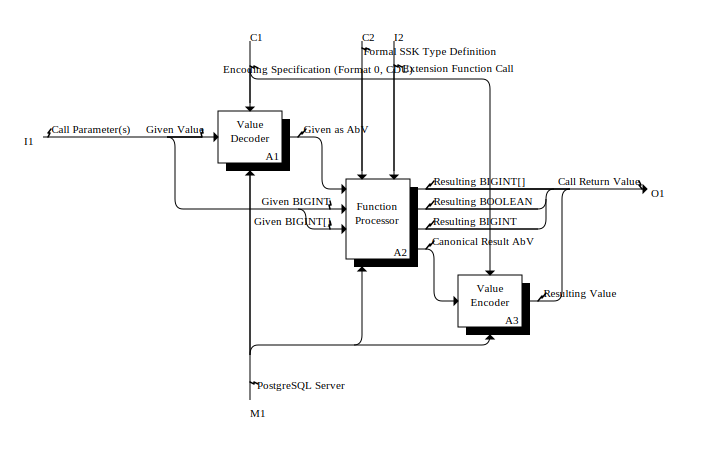
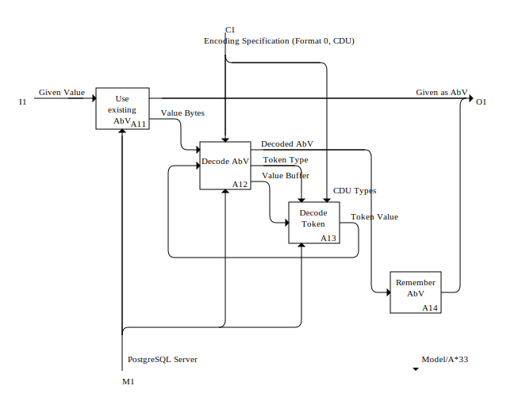
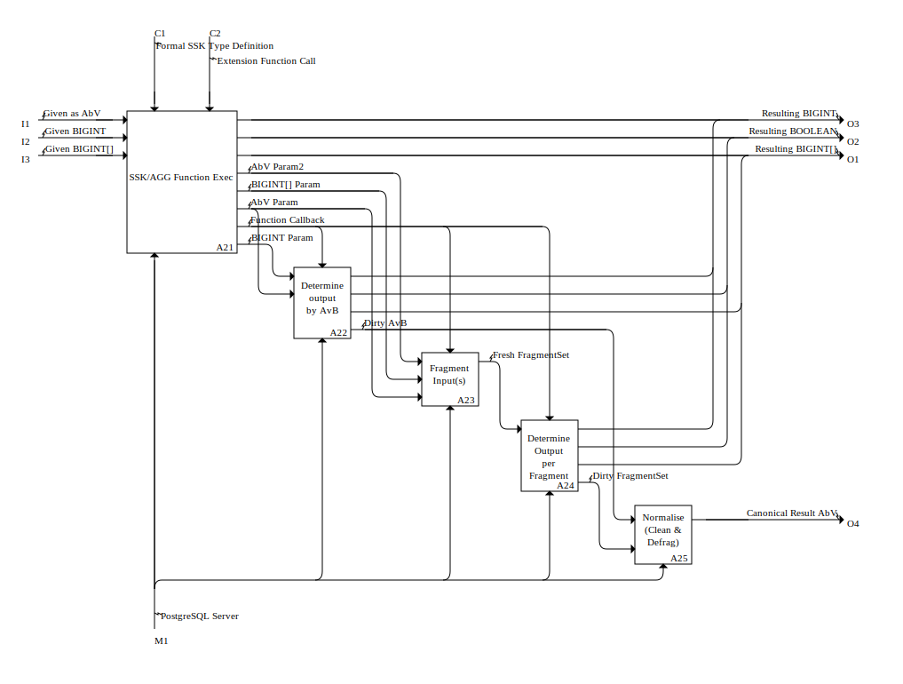

# Implementation Concerns Model (IMP)

**IDEF0 Model Report**  
**Date**: December 24, 2025

---

**Repository:** Open Source SSK;  Date:  12/25/2025

# 

# Repository:  Open Source SSK

# Repository Summary

**Used At:** LobeShare
**Creator:** Marthin Laubscher

## Description

This repository deals with the extraction of SSK as defined and used by Synoida into a separate public GitHub Repository aimed at allowing the enormous potential the SubSet Key bijection has in the wider database industry and its countless customers, end-users, their customers, and the plethora of ventures that form and service the entire value chain.

# Model:  Implementation Concerns

# Model Summary

**Name:** Implementation Concerns
**Creator:** Marthin Laubscher

## Purpose

As a repository and C Language project, SSK is misleadingly lobsided. The core concept is incredibly simple once grasped, with full implementation of the trivial case probably not even worth adding a second source file. Meanwhile the code base is dominated by the complexities arising from a secondary problem - scaling that super-simple core to a the required domain.
This model seeks to create stable, useful separation of concerns to manage that complexity better by drawing clear lines with well defined interactions between them.
Do not expect to see a source file per concern, that is not the way.

# Title:Implementation Concerns

## Activities in Diagram"Implementation Concerns"

| Activity | Creator |
| --- | --- |
| [A0: The SSK Extension](#titlea0-the-ssk-extension) | Marthin Laubscher |

## Concepts in Diagram"Implementation Concerns"

| Concept | Creator |
| --- | --- |
| Extension Function Call | Marthin Laubscher |
| Call Return Value | Marthin Laubscher |
| Call Parameter(s) | Marthin Laubscher |
| Formal SSK Type Definition | Marthin Laubscher |
| PostgreSQL Server | Marthin Laubscher |
| Encoding Specification (Format 0, CDU) | Marthin Laubscher |

# Title:A0: The SSK Extension

# Diagram Summary

**Name:** A0: The SSK Extension
**Creator:** Marthin Laubscher

## Activities in Diagram"[A0: The SSK Extension](#titleimplementation-concerns)"

| Activity | Creator |
| --- | --- |
| [A1: Value Decoder](#titlea1-value-decoder) | Marthin Laubscher |
| [A2: Function Processor](#titlea2-function-processor) | Marthin Laubscher |
| [A3: Value Encoder](#titlea3-value-encoder) | Marthin Laubscher |

## Concepts in Diagram"[A0: The SSK Extension](#titleimplementation-concerns)"

| Concept | Creator | Notes |
| --- | --- | --- |
| Given Value | Marthin Laubscher |  |
| Given as AbV | Marthin Laubscher | It's b for bit, B for Byte, so abstract bit value is abbreviated AbV: |
| Encoding Specification (Format 0, CDU) | Marthin Laubscher |  |
| PostgreSQL Server | Marthin Laubscher |  |
| Given BIGINT | Marthin Laubscher |  |
| Given BIGINT[] | Marthin Laubscher |  |
| Resulting BIGINT | Marthin Laubscher |  |
| Resulting BOOLEAN | Marthin Laubscher |  |
| Resulting BIGINT[] | Marthin Laubscher |  |
| Canonical Result AbV | Marthin Laubscher | It's b for bit, B for Byte, so abstract bit value is abbreviated AbV: |
| Formal SSK Type Definition | Marthin Laubscher |  |
| Extension Function Call | Marthin Laubscher |  |
| Resulting Value | Marthin Laubscher |  |
| Call Parameter(s) | Marthin Laubscher |  |
| Call Return Value | Marthin Laubscher |  |

# Title:A1: Value Decoder

# Diagram Summary

**Name:** A1: Value Decoder
**Creator:** Marthin Laubscher

## Activities in Diagram"[A1: Value Decoder](#titlea0-the-ssk-extension)"

| Activity | Creator | Call Arrow Destinations |
| --- | --- | --- |
| A11: Use existing AbV | Marthin Laubscher |  |
| A12: Decode AbV | Marthin Laubscher |  |
| A13: Decode Token | Marthin Laubscher |  |
| A14: Remember AbV | Marthin Laubscher | Model/A*33 |

## Concepts in Diagram"[A1: Value Decoder](#titlea0-the-ssk-extension)"

| Concept | Creator | Notes |
| --- | --- | --- |
| Given Value | Marthin Laubscher |  |
| Encoding Specification (Format 0, CDU) | Marthin Laubscher |  |
| Given as AbV | Marthin Laubscher | It's b for bit, B for Byte, so abstract bit value is abbreviated AbV: |
| PostgreSQL Server | Marthin Laubscher |  |
| Value Bytes | Marthin Laubscher |  |
| Token Value | Marthin Laubscher |  |
| Decoded AbV | Marthin Laubscher | It's b for bit, B for Byte, so abstract bit value is abbreviated AbV: |
| Token Type | Marthin Laubscher |  |
| Value Buffer | Marthin Laubscher |  |
| CDU Types | Marthin Laubscher |  |

# Title:A2: Function Processor

# Diagram Summary

**Name:** A2: Function Processor
**Creator:** Marthin Laubscher

## Activities in Diagram"[A2: Function Processor](#titlea0-the-ssk-extension)"

| Activity | Creator |
| --- | --- |
| A21: SSK/AGG Function Exec | Marthin Laubscher |
| A22: Determine output by AvB | Marthin Laubscher |
| A23: Fragment Input(s) | Marthin Laubscher |
| A24: Determine Output per Fragment | Marthin Laubscher |
| A25: Normalise (Clean & Defrag) | Marthin Laubscher |

## Concepts in Diagram"[A2: Function Processor](#titlea0-the-ssk-extension)"

| Concept | Creator | Notes |
| --- | --- | --- |
| Given as AbV | Marthin Laubscher | It's b for bit, B for Byte, so abstract bit value is abbreviated AbV: |
| Given BIGINT | Marthin Laubscher |  |
| Given BIGINT[] | Marthin Laubscher |  |
| Formal SSK Type Definition | Marthin Laubscher |  |
| Extension Function Call | Marthin Laubscher |  |
| Resulting BIGINT | Marthin Laubscher |  |
| Resulting BOOLEAN | Marthin Laubscher |  |
| Resulting BIGINT[] | Marthin Laubscher |  |
| Canonical Result AbV | Marthin Laubscher | It's b for bit, B for Byte, so abstract bit value is abbreviated AbV: |
| PostgreSQL Server | Marthin Laubscher |  |
| AbV Param2 | Marthin Laubscher |  |
| BIGINT[] Param | Marthin Laubscher |  |
| Function Callback | Marthin Laubscher |  |
| BIGINT Param | Marthin Laubscher |  |
| AbV Param | Marthin Laubscher |  |
| Dirty AvB | Marthin Laubscher | It's b for bit, B for Byte, so abstract bit value is abbreviated AbV: |
| Fresh FragmentSet | Marthin Laubscher |  |
| Dirty FragmentSet | Marthin Laubscher |  |

# Title:A3: Value Encoder

# Diagram Summary

**Name:** A3: Value Encoder
**Creator:** Marthin Laubscher

## Activities in Diagram"[A3: Value Encoder](#titlea0-the-ssk-extension)"

| Activity | Creator |
| --- | --- |
| A31: Encode AbV | Marthin Laubscher |
| A32: Encode Token | Marthin Laubscher |
| A33: Conditionally Remember AbV | Marthin Laubscher |

## Concepts in Diagram"[A3: Value Encoder](#titlea0-the-ssk-extension)"

| Concept | Creator | Notes |
| --- | --- | --- |
| Canonical Result AbV | Marthin Laubscher | It's b for bit, B for Byte, so abstract bit value is abbreviated AbV: |
| Encoding Specification (Format 0, CDU) | Marthin Laubscher |  |
| Resulting Value | Marthin Laubscher |  |
| PostgreSQL Server | Marthin Laubscher |  |
| Encoded Token | Marthin Laubscher |  |
| Encoded Value | Marthin Laubscher |  |
| Token to Encode | Marthin Laubscher |  |
| CDU Types | Marthin Laubscher |  |

Date Created:	12/24/2025  01:15.32
Last Modified:	12/24/2025  01:15.32

## Concepts in Diagram"[A3: Value Encoder](#titlea0-the-ssk-extension)"

| Concept | Creator | Date Created | Last Modified |
| --- | --- | --- | --- |
| Canonical Result AbV | Marthin Laubscher | 12/24/2025  01:52.30 | 12/24/2025  03:36.05 |
| Encoding Specification (Format 0, CDU) | Marthin Laubscher | 12/24/2025  01:52.30 | 12/24/2025  03:36.05 |
| Resulting Value | Marthin Laubscher | 12/24/2025  01:52.30 | 12/24/2025  03:36.05 |
| PostgreSQL Server | Marthin Laubscher | 12/24/2025  01:52.30 | 12/24/2025  01:52.30 |
| Encoded Token | Marthin Laubscher | 12/24/2025  01:52.30 | 12/24/2025  03:36.05 |
| Encoded Value | Marthin Laubscher | 12/24/2025  01:52.30 | 12/24/2025  03:36.05 |
| Token to Encode | Marthin Laubscher | 12/24/2025  01:52.30 | 12/24/2025  03:36.05 |
| CDU Types | Marthin Laubscher | 12/24/2025  01:52.30 | 12/24/2025  03:36.05 |