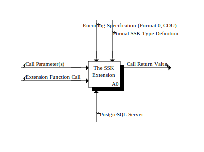
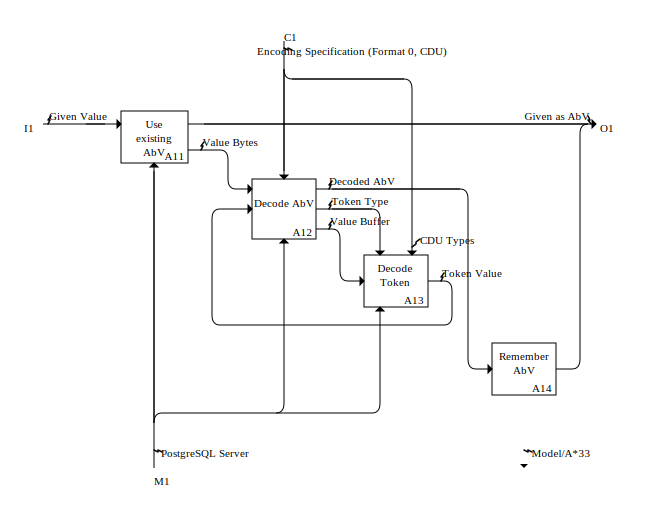
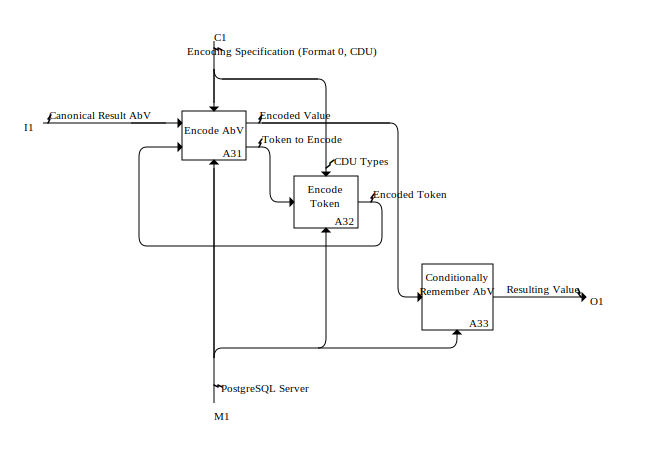

# Implementation Concerns

## Context Diagram

*Created by Marthin Laubscheron 2026-01-02 16:29:29, last modified 2026-01-02 16:29:30*

### Area A0: The SSK Extension
|  | Role        | Name                                   | Details                               |
|--| :---------  | :------------------------------------- | ------------------------------------- |
|  | Impetus     | Call Parameter(s)                      |                                       |
|  | Impetus     | Extension Function Call                |                                       |
|  |             |                                        |                                       |
|  | Constraint  | Encoding Specification (Format 0, CDU) |                                       |
|  | Constraint  | Formal SSK Type Definition             |                                       |
|  |             |                                        |                                       |
|  | Outcome     | Call Return Value                      |                                       |
|  |             |                                        |                                       |
|  | Means       | PostgreSQL Server                      |                                       |

---

## Separation of Concerns in Area A0: The SSK Extension

### Interaction
| Role        | *#  | Name                                   | Details                               |
| :---------  |:---:| :------------------------------------- | ------------------------------------- |

| Impetus     | I1  | Call Parameter(s)                      | Union, see [1](#note-1)               |
| Impetus     | I2  | Extension Function Call                | Constraint on A2: Function Processor  |
|             |     |                                        |                                       |
| Constraint  | C1  | Encoding Specification (Format 0, CDU) | Constraint on A1: Value Decoder; Constraint on A3: Value Encoder |
| Constraint  | C2  | Formal SSK Type Definition             | Constraint on A2: Function Processor  |
|             |     |                                        |                                       |

| Outcome     | O1  | Call Return Value                      | Union, see [2](#note-2)               |
|             |     |                                        |                                       |
| Means       | M1  | PostgreSQL Server                      | Means on A1: Value Decoder; Means on A2: Function Processor; Means on A3: Value Encoder |

### Notes

**[1]** [I1: Call Parameter(s)](#back-1) has types:
- **Given BIGINT[]**
  - Impetus on A2: Function Processor

- **Given BIGINT**
  - Impetus on A2: Function Processor

- **Given Value**
  - Impetus on A1: Value Decoder

**[2]** [O1: Call Return Value](#back-2) has types:
- **Resulting Value**
  - Outcome on A3: Value Encoder

- **Resulting BIGINT[]**
  - Outcome on A2: Function Processor

- **Resulting BOOLEAN**
  - Outcome on A2: Function Processor

- **Resulting BIGINT**
  - Outcome on A2: Function Processor

### Constituent Areas

#### A1: Value Decoder

*Created by Marthin Laubscheron 2026-01-02 16:29:29, last modified 2026-01-02 16:35:55*

|  | Role       | *# | Name                                   | Details                               |
|--| :--------- |:--:| -------------------------------------- | ------------------------------------- |
|  | Impetus    |    | Given Value                            | Part of I1: Call Parameter(s)         |
|  |            |    |                                        |                                       |
|  |            |                                        |                                       |
|  | Constraint | C1 | Encoding Specification (Format 0, CDU) | From A0: The SSK Extension            |
|  |            |    |                                        |                                       |
|  |            |                                        |                                       |
|  | Outcome    |    | Given as AbV                           | Impetus of A2: Function Processor     |
|  |            |    |                                        |                                       |
|  |            |                                        |                                       |
|  | Means      | M1 | PostgreSQL Server                      | From A0: The SSK Extension            |
|  |            |    |                                        |                                       |

#### A2: Function Processor

*Created by Marthin Laubscheron 2026-01-02 16:29:29, last modified 2026-01-02 16:35:55*

|  | Role       | *# | Name                                   | Details                               |
|--| :--------- |:--:| -------------------------------------- | ------------------------------------- |
|  | Impetus    |    | Given as AbV                           | Outcome of A1: Value Decoder          |
|  |            |    |                                        |                                       |
|  | Impetus    |    | Given BIGINT                           | Part of I1: Call Parameter(s)         |
|  |            |    |                                        |                                       |
|  | Impetus    |    | Given BIGINT[]                         | Part of I1: Call Parameter(s)         |
|  |            |    |                                        |                                       |
|  |            |                                        |                                       |
|  | Constraint | C2 | Formal SSK Type Definition             | From A0: The SSK Extension            |
|  |            |    |                                        |                                       |
|  | Constraint | I2 | Extension Function Call                | From A0: The SSK Extension            |
|  |            |    |                                        |                                       |
|  |            |                                        |                                       |
|  | Outcome    |    | Resulting BIGINT                       | Part of O1: Call Return Value         |
|  |            |    |                                        |                                       |
|  | Outcome    |    | Resulting BOOLEAN                      | Part of O1: Call Return Value         |
|  |            |    |                                        |                                       |
|  | Outcome    |    | Resulting BIGINT[]                     | Part of O1: Call Return Value         |
|  |            |    |                                        |                                       |
|  | Outcome    |    | Canonical Result AbV                   | Impetus of A3: Value Encoder          |
|  |            |    |                                        |                                       |
|  |            |                                        |                                       |
|  | Means      | M1 | PostgreSQL Server                      | From A0: The SSK Extension            |
|  |            |    |                                        |                                       |

#### A3: Value Encoder

*Created by Marthin Laubscheron 2026-01-02 16:29:29, last modified 2026-01-02 16:35:55*

|  | Role       | *# | Name                                   | Details                               |
|--| :--------- |:--:| -------------------------------------- | ------------------------------------- |
|  | Impetus    |    | Canonical Result AbV                   | Outcome of A2: Function Processor     |
|  |            |    |                                        |                                       |
|  |            |                                        |                                       |
|  | Constraint | C1 | Encoding Specification (Format 0, CDU) | From A0: The SSK Extension            |
|  |            |    |                                        |                                       |
|  |            |                                        |                                       |
|  | Outcome    |    | Resulting Value                        | Part of O1: Call Return Value         |
|  |            |    |                                        |                                       |
|  |            |                                        |                                       |
|  | Means      | M1 | PostgreSQL Server                      | From A0: The SSK Extension            |
|  |            |    |                                        |                                       |

---

## Separation of Concerns in Area A1: Value Decoder

### Interaction
| Role        | *#  | Name                                   | Details                               |
| :---------  |:---:| :------------------------------------- | ------------------------------------- |
| Impetus     | I1  | Given Value                            | Impetus on A11: Use existing AbV      |
|             |     |                                        |                                       |

| Constraint  | C1  | Encoding Specification (Format 0, CDU) | Structure, see [3](#note-3)           |
|             |     |                                        |                                       |
| Outcome     | O1  | Given as AbV                           | Outcome on A11: Use existing AbV; Outcome on A14: Remember AbV |
|             |     |                                        |                                       |
| Means       | M1  | PostgreSQL Server                      | Means on A11: Use existing AbV; Means on A12: Decode AbV; Means on A13: Decode Token |

### Notes

**[3]** [C1: Encoding Specification (Format 0, CDU)](#back-3) has parts:
- **CDU Types**
  - Constraint on A13: Decode Token

### Constituent Areas

#### A11: Use existing AbV

*Created by Marthin Laubscheron 2026-01-02 16:29:29, last modified 2026-01-02 16:35:55*

|  | Role       | *# | Name                                   | Details                               |
|--| :--------- |:--:| -------------------------------------- | ------------------------------------- |
|  | Impetus    |    | Given Value                            |                                       |
|  |            |    |                                        |                                       |
|  |            |                                        |                                       |
|  | Outcome    |    | Given as AbV                           | Outcome of A14: Remember AbV          |
|  |            |    |                                        |                                       |
|  | Outcome    |    | Value Bytes                            | Impetus of A12: Decode AbV            |
|  |            |    |                                        |                                       |
|  |            |                                        |                                       |
|  | Means      | M1 | PostgreSQL Server                      | From A1: Value Decoder                |
|  |            |    |                                        |                                       |

#### A12: Decode AbV

*Created by Marthin Laubscheron 2026-01-02 16:29:29, last modified 2026-01-02 16:35:55*

|  | Role       | *# | Name                                   | Details                               |
|--| :--------- |:--:| -------------------------------------- | ------------------------------------- |
|  | Impetus    |    | Value Bytes                            | Outcome of A11: Use existing AbV      |
|  |            |    |                                        |                                       |
|  | Impetus    |    | Token Value                            | Outcome of A13: Decode Token          |
|  |            |    |                                        |                                       |
|  |            |                                        |                                       |
|  | Constraint | C1 | Encoding Specification (Format 0, CDU) | From A1: Value Decoder                |
|  |            |    |                                        |                                       |
|  |            |                                        |                                       |
|  | Outcome    |    | Decoded AbV                            | Impetus of A14: Remember AbV          |
|  |            |    |                                        |                                       |
|  | Outcome    |    | Token Type                             | Constraint on A13: Decode Token       |
|  |            |    |                                        |                                       |
|  | Outcome    |    | Value Buffer                           | Impetus of A13: Decode Token          |
|  |            |    |                                        |                                       |
|  |            |                                        |                                       |
|  | Means      | M1 | PostgreSQL Server                      | From A1: Value Decoder                |
|  |            |    |                                        |                                       |

#### A13: Decode Token

*Created by Marthin Laubscheron 2026-01-02 16:29:29, last modified 2026-01-02 16:35:55*

|  | Role       | *# | Name                                   | Details                               |
|--| :--------- |:--:| -------------------------------------- | ------------------------------------- |
|  | Impetus    |    | Value Buffer                           | Outcome of A12: Decode AbV            |
|  |            |    |                                        |                                       |
|  |            |                                        |                                       |
|  | Constraint |    | Token Type                             | Outcome of A12: Decode AbV            |
|  |            |    |                                        |                                       |
|  | Constraint |    | CDU Types                              | Part of C1: Encoding Specification (Format 0, CDU) |
|  |            |    |                                        |                                       |
|  |            |                                        |                                       |
|  | Outcome    |    | Token Value                            | Impetus of A12: Decode AbV            |
|  |            |    |                                        |                                       |
|  |            |                                        |                                       |
|  | Means      | M1 | PostgreSQL Server                      | From A1: Value Decoder                |
|  |            |    |                                        |                                       |

#### A14: Remember AbV

*Created by Marthin Laubscheron 2026-01-02 16:29:29, last modified 2026-01-02 16:35:55*

|  | Role       | *# | Name                                   | Details                               |
|--| :--------- |:--:| -------------------------------------- | ------------------------------------- |
|  | Impetus    |    | Decoded AbV                            | Outcome of A12: Decode AbV            |
|  |            |    |                                        |                                       |
|  |            |                                        |                                       |
|  | Outcome    |    | Given as AbV                           | Outcome of A11: Use existing AbV      |
|  |            |    |                                        |                                       |

---

## Separation of Concerns in Area A2: Function Processor

### Interaction
| Role        | *#  | Name                                   | Details                               |
| :---------  |:---:| :------------------------------------- | ------------------------------------- |
| Impetus     | I1  | Given as AbV                           | Impetus on A21: SSK/AGG Function Exec |
| Impetus     | I2  | Given BIGINT                           | Impetus on A21: SSK/AGG Function Exec |
| Impetus     | I3  | Given BIGINT[]                         | Impetus on A21: SSK/AGG Function Exec |
|             |     |                                        |                                       |
| Constraint  | C1  | Formal SSK Type Definition             | Constraint on A21: SSK/AGG Function Exec |
| Constraint  | C2  | Extension Function Call                | Constraint on A21: SSK/AGG Function Exec |
|             |     |                                        |                                       |
| Outcome     | O1  | Resulting BIGINT                       | Outcome on A21: SSK/AGG Function Exec; Outcome on A22: Determine output by AvB; Outcome on A24: Determine Output per Fragment |
| Outcome     | O2  | Resulting BOOLEAN                      | Outcome on A21: SSK/AGG Function Exec; Outcome on A22: Determine output by AvB; Outcome on A24: Determine Output per Fragment |
| Outcome     | O3  | Resulting BIGINT[]                     | Outcome on A21: SSK/AGG Function Exec; Outcome on A22: Determine output by AvB; Outcome on A24: Determine Output per Fragment |
| Outcome     | O4  | Canonical Result AbV                   | Outcome on A25: Normalise (Clean & Defrag) |
|             |     |                                        |                                       |
| Means       | M1  | PostgreSQL Server                      | Means on A21: SSK/AGG Function Exec; Means on A22: Determine output by AvB; Means on A23: Fragment Input(s); Means on A24: Determine Output per Fragment; Means on A25: Normalise (Clean & Defrag) |

### Constituent Areas

#### A21: SSK/AGG Function Exec

*Created by Marthin Laubscheron 2026-01-02 16:29:29, last modified 2026-01-02 16:35:55*

|  | Role       | *# | Name                                   | Details                               |
|--| :--------- |:--:| -------------------------------------- | ------------------------------------- |
|  | Impetus    |    | Given as AbV                           |                                       |
|  |            |    |                                        |                                       |
|  | Impetus    |    | Given BIGINT                           |                                       |
|  |            |    |                                        |                                       |
|  | Impetus    |    | Given BIGINT[]                         |                                       |
|  |            |    |                                        |                                       |
|  |            |                                        |                                       |
|  | Constraint | C2 | Formal SSK Type Definition             | From A2: Function Processor           |
|  |            |    |                                        |                                       |
|  | Constraint | I2 | Extension Function Call                | From A2: Function Processor           |
|  |            |    |                                        |                                       |
|  |            |                                        |                                       |
|  | Outcome    |    | Resulting BIGINT                       | Outcome of A22: Determine output by AvB |
|  |            |    |                                        |                                       |
|  | Outcome    |    | Resulting BOOLEAN                      | Outcome of A22: Determine output by AvB |
|  |            |    |                                        |                                       |
|  | Outcome    |    | Resulting BIGINT[]                     | Outcome of A22: Determine output by AvB |
|  |            |    |                                        |                                       |
|  | Outcome    |    | Second AbV Parameter                   | Impetus of A23: Fragment Input(s)     |
|  |            |    |                                        |                                       |
|  | Outcome    |    | BIGINT[] Param                         | Impetus of A23: Fragment Input(s)     |
|  |            |    |                                        |                                       |
|  | Outcome    |    | AbV Parameter                          | Impetus of A22: Determine output by AvB |
|  |            |    |                                        |                                       |
|  | Outcome    |    | Function Callback                      | Constraint on A22: Determine output by AvB |
|  |            |    |                                        |                                       |
|  | Outcome    |    | BIGINT Param                           | Impetus of A22: Determine output by AvB |
|  |            |    |                                        |                                       |
|  |            |                                        |                                       |
|  | Means      | M1 | PostgreSQL Server                      | From A2: Function Processor           |
|  |            |    |                                        |                                       |

#### A22: Determine output by AvB

*Created by Marthin Laubscheron 2026-01-02 16:29:29, last modified 2026-01-02 16:35:55*

|  | Role       | *# | Name                                   | Details                               |
|--| :--------- |:--:| -------------------------------------- | ------------------------------------- |
|  | Impetus    |    | BIGINT Param                           | Outcome of A21: SSK/AGG Function Exec |
|  |            |    |                                        |                                       |
|  | Impetus    |    | AbV Parameter                          | Outcome of A21: SSK/AGG Function Exec |
|  |            |    |                                        |                                       |
|  |            |                                        |                                       |
|  | Constraint |    | Function Callback                      | Outcome of A21: SSK/AGG Function Exec |
|  |            |    |                                        |                                       |
|  |            |                                        |                                       |
|  | Outcome    |    | Resulting BIGINT                       | Outcome of A21: SSK/AGG Function Exec |
|  |            |    |                                        |                                       |
|  | Outcome    |    | Resulting BOOLEAN                      | Outcome of A21: SSK/AGG Function Exec |
|  |            |    |                                        |                                       |
|  | Outcome    |    | Resulting BIGINT[]                     | Outcome of A21: SSK/AGG Function Exec |
|  |            |    |                                        |                                       |
|  | Outcome    |    | Dirty AvB                              | Impetus of A25: Normalise (Clean & Defrag) |
|  |            |    |                                        |                                       |
|  |            |                                        |                                       |
|  | Means      | M1 | PostgreSQL Server                      | From A2: Function Processor           |
|  |            |    |                                        |                                       |

#### A23: Fragment Input(s)

*Created by Marthin Laubscheron 2026-01-02 16:29:29, last modified 2026-01-02 16:35:55*

|  | Role       | *# | Name                                   | Details                               |
|--| :--------- |:--:| -------------------------------------- | ------------------------------------- |
|  | Impetus    |    | Second AbV Parameter                   | Outcome of A21: SSK/AGG Function Exec |
|  |            |    |                                        |                                       |
|  | Impetus    |    | BIGINT[] Param                         | Outcome of A21: SSK/AGG Function Exec |
|  |            |    |                                        |                                       |
|  | Impetus    |    | AbV Parameter                          | Outcome of A21: SSK/AGG Function Exec |
|  |            |    |                                        |                                       |
|  |            |                                        |                                       |
|  | Constraint |    | Function Callback                      | Outcome of A21: SSK/AGG Function Exec |
|  |            |    |                                        |                                       |
|  |            |                                        |                                       |
|  | Outcome    |    | Fresh FragmentSet                      | Impetus of A24: Determine Output per Fragment |
|  |            |    |                                        |                                       |
|  |            |                                        |                                       |
|  | Means      | M1 | PostgreSQL Server                      | From A2: Function Processor           |
|  |            |    |                                        |                                       |

#### A24: Determine Output per Fragment

*Created by Marthin Laubscheron 2026-01-02 16:29:29, last modified 2026-01-02 16:35:55*

|  | Role       | *# | Name                                   | Details                               |
|--| :--------- |:--:| -------------------------------------- | ------------------------------------- |
|  | Impetus    |    | Fresh FragmentSet                      | Outcome of A23: Fragment Input(s)     |
|  |            |    |                                        |                                       |
|  |            |                                        |                                       |
|  | Constraint |    | Function Callback                      | Outcome of A21: SSK/AGG Function Exec |
|  |            |    |                                        |                                       |
|  |            |                                        |                                       |
|  | Outcome    |    | Resulting BIGINT                       | Outcome of A21: SSK/AGG Function Exec |
|  |            |    |                                        |                                       |
|  | Outcome    |    | Resulting BOOLEAN                      | Outcome of A21: SSK/AGG Function Exec |
|  |            |    |                                        |                                       |
|  | Outcome    |    | Resulting BIGINT[]                     | Outcome of A21: SSK/AGG Function Exec |
|  |            |    |                                        |                                       |
|  | Outcome    |    | Dirty FragmentSet                      | Impetus of A25: Normalise (Clean & Defrag) |
|  |            |    |                                        |                                       |
|  |            |                                        |                                       |
|  | Means      | M1 | PostgreSQL Server                      | From A2: Function Processor           |
|  |            |    |                                        |                                       |

#### A25: Normalise (Clean & Defrag)

*Created by Marthin Laubscheron 2026-01-02 16:29:29, last modified 2026-01-02 16:35:55*

|  | Role       | *# | Name                                   | Details                               |
|--| :--------- |:--:| -------------------------------------- | ------------------------------------- |
|  | Impetus    |    | Dirty AvB                              | Outcome of A22: Determine output by AvB |
|  |            |    |                                        |                                       |
|  | Impetus    |    | Dirty FragmentSet                      | Outcome of A24: Determine Output per Fragment |
|  |            |    |                                        |                                       |
|  |            |                                        |                                       |
|  | Outcome    |    | Canonical Result AbV                   |                                       |
|  |            |    |                                        |                                       |
|  |            |                                        |                                       |
|  | Means      | M1 | PostgreSQL Server                      | From A2: Function Processor           |
|  |            |    |                                        |                                       |

---

## Separation of Concerns in Area A3: Value Encoder

### Interaction
| Role        | *#  | Name                                   | Details                               |
| :---------  |:---:| :------------------------------------- | ------------------------------------- |
| Impetus     | I1  | Canonical Result AbV                   | Impetus on A31: Encode AbV            |
|             |     |                                        |                                       |

| Constraint  | C1  | Encoding Specification (Format 0, CDU) | Structure, see [4](#note-4)           |
|             |     |                                        |                                       |
| Outcome     | O1  | Resulting Value                        | Outcome on A33: Conditionally Remember AbV |
|             |     |                                        |                                       |
| Means       | M1  | PostgreSQL Server                      | Means on A31: Encode AbV; Means on A32: Encode Token; Means on A33: Conditionally Remember AbV |

### Notes

**[4]** [C1: Encoding Specification (Format 0, CDU)](#back-4) has parts:
- **CDU Types**
  - Constraint on A32: Encode Token

### Constituent Areas

#### A31: Encode AbV

*Created by Marthin Laubscheron 2026-01-02 16:29:29, last modified 2026-01-02 16:35:55*

|  | Role       | *# | Name                                   | Details                               |
|--| :--------- |:--:| -------------------------------------- | ------------------------------------- |
|  | Impetus    |    | Canonical Result AbV                   |                                       |
|  |            |    |                                        |                                       |
|  | Impetus    |    | Encoded Token                          | Outcome of A32: Encode Token          |
|  |            |    |                                        |                                       |
|  |            |                                        |                                       |
|  | Constraint | C1 | Encoding Specification (Format 0, CDU) | From A3: Value Encoder                |
|  |            |    |                                        |                                       |
|  |            |                                        |                                       |
|  | Outcome    |    | Encoded Value                          | Impetus of A33: Conditionally Remember AbV |
|  |            |    |                                        |                                       |
|  | Outcome    |    | Token to Encode                        | Impetus of A32: Encode Token          |
|  |            |    |                                        |                                       |
|  |            |                                        |                                       |
|  | Means      | M1 | PostgreSQL Server                      | From A3: Value Encoder                |
|  |            |    |                                        |                                       |

#### A32: Encode Token

*Created by Marthin Laubscheron 2026-01-02 16:29:29, last modified 2026-01-02 16:35:55*

|  | Role       | *# | Name                                   | Details                               |
|--| :--------- |:--:| -------------------------------------- | ------------------------------------- |
|  | Impetus    |    | Token to Encode                        | Outcome of A31: Encode AbV            |
|  |            |    |                                        |                                       |
|  |            |                                        |                                       |
|  | Constraint |    | CDU Types                              | Part of C1: Encoding Specification (Format 0, CDU) |
|  |            |    |                                        |                                       |
|  |            |                                        |                                       |
|  | Outcome    |    | Encoded Token                          | Impetus of A31: Encode AbV            |
|  |            |    |                                        |                                       |
|  |            |                                        |                                       |
|  | Means      | M1 | PostgreSQL Server                      | From A3: Value Encoder                |
|  |            |    |                                        |                                       |

#### A33: Conditionally Remember AbV

*Created by Marthin Laubscheron 2026-01-02 16:29:29, last modified 2026-01-02 16:35:55*

|  | Role       | *# | Name                                   | Details                               |
|--| :--------- |:--:| -------------------------------------- | ------------------------------------- |
|  | Impetus    |    | Encoded Value                          | Outcome of A31: Encode AbV            |
|  |            |    |                                        |                                       |
|  |            |                                        |                                       |
|  | Outcome    |    | Resulting Value                        |                                       |
|  |            |    |                                        |                                       |
|  |            |                                        |                                       |
|  | Means      | M1 | PostgreSQL Server                      | From A3: Value Encoder                |
|  |            |    |                                        |                                       |

---
