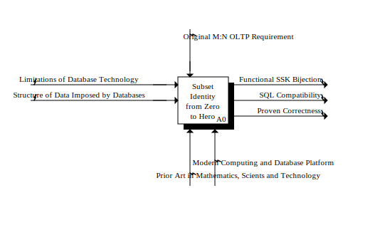
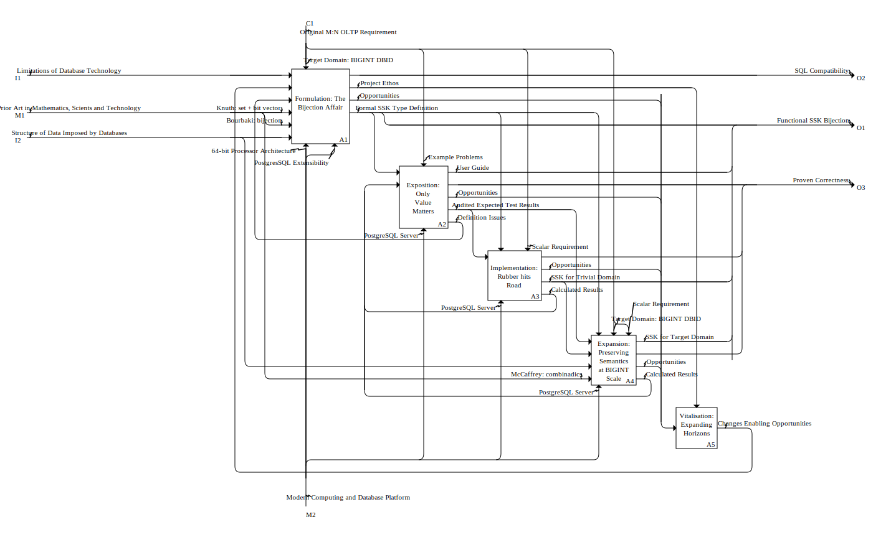

# Project Concerns

## Context Diagram

### Area A0: Subset Identity from Zero to Hero
|  | Role        | Name                                   | Details                               |
|--| :---------  | :------------------------------------- | ------------------------------------- |
|  | Impetus     | Limitations of Database Technology     |                                       |
|  | Impetus     | Structure of Data Imposed by Databases |                                       |
|  |             |                                        |                                       |
|  | Constraint  | Original M:N OLTP Requirement          |                                       |
|  |             |                                        |                                       |
|  | Outcome     | Functional SSK Bijection               |                                       |
|  | Outcome     | SQL Compatibility                      |                                       |
|  | Outcome     | Proven Correctness                     |                                       |
|  |             |                                        |                                       |
|  | Means       | Prior Art in Mathematics, Scients and Technology |                                       |
|  | Means       | Modern Computing and Database Platform |                                       |

---

## Separation of Concerns in Area A0: Subset Identity from Zero to Hero

### Interaction
| Role        | *#  | Name                                   | Details                               |
| :---------  |:---:| :------------------------------------- | ------------------------------------- |
| Impetus     | I1  | Limitations of Database Technology     | Impetus on A1: Formulation: The Bijection Affair |
| Impetus     | I2  | Structure of Data Imposed by Databases | Impetus on A1: Formulation: The Bijection Affair; Impetus on A4: Expansion: Preserving Semantics at BIGINT Scale |
|             |     |                                        |                                       |

| Constraint  | C1  | Original M:N OLTP Requirement          | Structure, see [1](#note-1)           |
|             |     |                                        |                                       |

| Outcome     | O1  | Functional SSK Bijection               | Structure, see [2](#note-2)           |
| Outcome     | O2  | SQL Compatibility                      | Outcome on A1: Formulation: The Bijection Affair |
| Outcome     | O3  | Proven Correctness                     | Outcome on A2: Exposition: Nothing without Value; Outcome on A3: Implementation: Rubber hits Road; Outcome on A4: Expansion: Preserving Semantics at BIGINT Scale |
|             |     |                                        |                                       |

| Means       | M1  | Prior Art in Mathematics, Scients and Technology | Structure, see [3](#note-3)           |

| Means       | M2  | Modern Computing and Database Platform | Structure, see [4](#note-4)           |

### Notes

**[1]** [C1: Original M:N OLTP Requirement](#back-1) has parts:
- **Example Problems**
  - Constraint on A2: Exposition: Nothing without Value

- **Target Domain: BIGINT DBID**
  - Constraint on A1: Formulation: The Bijection Affair
  - Constraint on A4: Expansion: Preserving Semantics at BIGINT Scale

- **Scalar Requirement**
  - Constraint on A3: Implementation: Rubber hits Road
  - Constraint on A4: Expansion: Preserving Semantics at BIGINT Scale

**[2]** [O1: Functional SSK Bijection](#back-2) has parts:
- **Formal SSK Type Definition**
  - Outcome on A1: Formulation: The Bijection Affair
  - Impetus on A2: Exposition: Nothing without Value
  - Constraint on A3: Implementation: Rubber hits Road
  - Constraint on A4: Expansion: Preserving Semantics at BIGINT Scale

- **User Guide**
  - Outcome on A2: Exposition: Nothing without Value

- **SSK for Trivial Domain**
  - Outcome on A3: Implementation: Rubber hits Road
  - Impetus on A4: Expansion: Preserving Semantics at BIGINT Scale

- **SSK for Target Domain**
  - Outcome on A4: Expansion: Preserving Semantics at BIGINT Scale

**[3]** [M1: Prior Art in Mathematics, Scients and Technology](#back-3) has parts:
- **Bourbaki: bijection**
  - Impetus on A1: Formulation: The Bijection Affair

- **McCaffrey: combinadics**
  - Impetus on A4: Expansion: Preserving Semantics at BIGINT Scale

- **Knuth: set + bit vector**
  - Impetus on A1: Formulation: The Bijection Affair

**[4]** [M2: Modern Computing and Database Platform](#back-4) has parts:
- **PostgreSQL Server**
  - Means on A2: Exposition: Nothing without Value
  - Means on A3: Implementation: Rubber hits Road
  - Means on A4: Expansion: Preserving Semantics at BIGINT Scale

- **PostgresSQL Extensibility**
  - Means on A1: Formulation: The Bijection Affair

- **64-bit Processor Architecture**
  - Means on A1: Formulation: The Bijection Affair

### Constituent Areas

#### A1: Formulation: The Bijection Affair
|  | Role       | *# | Name                                   | Details                               |
|--| :--------- |:--:| -------------------------------------- | ------------------------------------- |
|  | Impetus    | I1 | Limitations of Database Technology     | From A0: Subset Identity from Zero to Hero |
|  |            |    |                                        |                                       |
|  | Impetus    |    | Changes Enabling Opportunities         | Outcome of A5: Vitalisation: Expanding Horizons |
|  |            |    |                                        |                                       |
|  | Impetus    |    | Definition Issues                      | Outcome of A2: Exposition: Nothing without Value |
|  |            |    |                                        |                                       |
|  | Impetus    |    | Knuth: set + bit vector                | Part of M1: Prior Art in Mathematics, Scients and Technology |
|  |            |    |                                        |                                       |
|  | Impetus    |    | Bourbaki: bijection                    | Part of M1: Prior Art in Mathematics, Scients and Technology |
|  |            |    |                                        |                                       |
|  | Impetus    | I2 | Structure of Data Imposed by Databases | From A0: Subset Identity from Zero to Hero |
|  |            |    |                                        |                                       |
|  |            |                                        |                                       |
|  | Constraint |    | Target Domain: BIGINT DBID             | Part of C1: Original M:N OLTP Requirement |
|  |            |    |                                        |                                       |
|  |            |                                        |                                       |
|  | Outcome    | O2 | SQL Compatibility                      | To A0: Subset Identity from Zero to Hero |
|  |            |    |                                        |                                       |
|  | Outcome    |    | Project Ethos                          | Constraint on A5: Vitalisation: Expanding Horizons |
|  |            |    |                                        |                                       |
|  | Outcome    |    | Opportunities                          | Outcome of A2: Exposition: Nothing without Value |
|  |            |    |                                        |                                       |
|  | Outcome    |    | Formal SSK Type Definition             | Part of O1: Functional SSK Bijection  |
|  |            |    |                                        |                                       |
|  |            |                                        |                                       |
|  | Means      |    | 64-bit Processor Architecture          | Part of M2: Modern Computing and Database Platform |
|  |            |    |                                        |                                       |
|  | Means      |    | PostgresSQL Extensibility              | Part of M2: Modern Computing and Database Platform |
|  |            |    |                                        |                                       |

#### A2: Exposition: Nothing without Value
|  | Role       | *# | Name                                   | Details                               |
|--| :--------- |:--:| -------------------------------------- | ------------------------------------- |
|  | Impetus    |    | Formal SSK Type Definition             | Part of O1: Functional SSK Bijection  |
|  |            |    |                                        |                                       |
|  | Impetus    |    | Calculated Results                     | Outcome of A3: Implementation: Rubber hits Road |
|  |            |    |                                        |                                       |
|  |            |                                        |                                       |
|  | Constraint |    | Example Problems                       | Part of C1: Original M:N OLTP Requirement |
|  |            |    |                                        |                                       |
|  |            |                                        |                                       |
|  | Outcome    |    | User Guide                             | Part of O1: Functional SSK Bijection  |
|  |            |    |                                        |                                       |
|  | Outcome    | O3 | Proven Correctness                     | To A0: Subset Identity from Zero to Hero |
|  |            |    |                                        |                                       |
|  | Outcome    |    | Opportunities                          | Outcome of A1: Formulation: The Bijection Affair |
|  |            |    |                                        |                                       |
|  | Outcome    |    | Audited Expected Test Results          | Impetus of A3: Implementation: Rubber hits Road |
|  |            |    |                                        |                                       |
|  | Outcome    |    | Definition Issues                      | Impetus of A1: Formulation: The Bijection Affair |
|  |            |    |                                        |                                       |
|  |            |                                        |                                       |
|  | Means      |    | PostgreSQL Server                      | Part of M2: Modern Computing and Database Platform |
|  |            |    |                                        |                                       |

#### A3: Implementation: Rubber hits Road
|  | Role       | *# | Name                                   | Details                               |
|--| :--------- |:--:| -------------------------------------- | ------------------------------------- |
|  | Impetus    |    | Audited Expected Test Results          | Outcome of A2: Exposition: Nothing without Value |
|  |            |    |                                        |                                       |
|  |            |                                        |                                       |
|  | Constraint |    | Formal SSK Type Definition             | Part of O1: Functional SSK Bijection  |
|  |            |    |                                        |                                       |
|  | Constraint |    | Scalar Requirement                     | Part of C1: Original M:N OLTP Requirement |
|  |            |    |                                        |                                       |
|  |            |                                        |                                       |
|  | Outcome    | O3 | Proven Correctness                     | To A0: Subset Identity from Zero to Hero |
|  |            |    |                                        |                                       |
|  | Outcome    |    | Opportunities                          | Outcome of A1: Formulation: The Bijection Affair |
|  |            |    |                                        |                                       |
|  | Outcome    |    | SSK for Trivial Domain                 | Part of O1: Functional SSK Bijection  |
|  |            |    |                                        |                                       |
|  | Outcome    |    | Calculated Results                     | Impetus of A2: Exposition: Nothing without Value |
|  |            |    |                                        |                                       |
|  |            |                                        |                                       |
|  | Means      |    | PostgreSQL Server                      | Part of M2: Modern Computing and Database Platform |
|  |            |    |                                        |                                       |

#### A4: Expansion: Preserving Semantics at BIGINT Scale
|  | Role       | *# | Name                                   | Details                               |
|--| :--------- |:--:| -------------------------------------- | ------------------------------------- |
|  | Impetus    |    | Audited Expected Test Results          | Outcome of A2: Exposition: Nothing without Value |
|  |            |    |                                        |                                       |
|  | Impetus    |    | SSK for Trivial Domain                 | Part of O1: Functional SSK Bijection  |
|  |            |    |                                        |                                       |
|  | Impetus    | I2 | Structure of Data Imposed by Databases | From A0: Subset Identity from Zero to Hero |
|  |            |    |                                        |                                       |
|  | Impetus    |    | McCaffrey: combinadics                 | Part of M1: Prior Art in Mathematics, Scients and Technology |
|  |            |    |                                        |                                       |
|  |            |                                        |                                       |
|  | Constraint |    | Formal SSK Type Definition             | Part of O1: Functional SSK Bijection  |
|  |            |    |                                        |                                       |
|  | Constraint |    | Target Domain: BIGINT DBID             | Part of C1: Original M:N OLTP Requirement |
|  |            |    |                                        |                                       |
|  | Constraint |    | Scalar Requirement                     | Part of C1: Original M:N OLTP Requirement |
|  |            |    |                                        |                                       |
|  |            |                                        |                                       |
|  | Outcome    |    | SSK for Target Domain                  | Part of O1: Functional SSK Bijection  |
|  |            |    |                                        |                                       |
|  | Outcome    | O3 | Proven Correctness                     | To A0: Subset Identity from Zero to Hero |
|  |            |    |                                        |                                       |
|  | Outcome    |    | Opportunities                          | Outcome of A1: Formulation: The Bijection Affair |
|  |            |    |                                        |                                       |
|  | Outcome    |    | Calculated Results                     | Impetus of A2: Exposition: Nothing without Value |
|  |            |    |                                        |                                       |
|  |            |                                        |                                       |
|  | Means      |    | PostgreSQL Server                      | Part of M2: Modern Computing and Database Platform |
|  |            |    |                                        |                                       |

#### A5: Vitalisation: Expanding Horizons
|  | Role       | *# | Name                                   | Details                               |
|--| :--------- |:--:| -------------------------------------- | ------------------------------------- |
|  | Impetus    |    | Opportunities                          | Outcome of A1: Formulation: The Bijection Affair |
|  |            |    |                                        |                                       |
|  |            |                                        |                                       |
|  | Constraint |    | Project Ethos                          | Outcome of A1: Formulation: The Bijection Affair |
|  |            |    |                                        |                                       |
|  |            |                                        |                                       |
|  | Outcome    |    | Changes Enabling Opportunities         | Impetus of A1: Formulation: The Bijection Affair |
|  |            |    |                                        |                                       |

---
