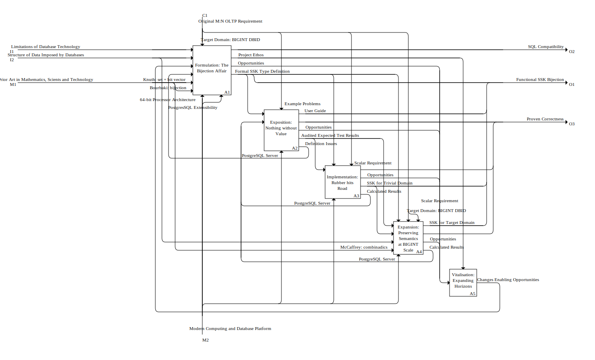

# Project Concerns

## Context Diagram

It is (hard, and) important to keep in mind that the purpose of this model is to separate concerns, not to design and structure the solution itself.

The intention being to replace Activity names with "OneWord"  or "Multiple Word Phraces (MWP)" to name concerns, broken down to at most one API function per "Activity/Concern" and nothing about the detail below that. 

For the Concept names, we stick with Object names from the domain, with state/purpose tagging as needed to keep them unique in as to not breqk the Activity Modelling rules.

### Area A0: Subset Identity from Zero to Hero
|  | Role        | Name                                   | Details                               |
|--| :---------  | :------------------------------------- | ------------------------------------- |
|  | Impetus     | Limitations of Database Technology     |                                       |
|  | Impetus     | Structure of Data Imposed by Databases |                                       |
|  |             |                                        |                                       |
|  | Constraint  | Original M:N OLTP Requirement          |                                       |
|  |             |                                        |                                       |
|  | Outcome     | Functional SSK Bijection               |                                       |
|  | Outcome     | SQL Compatibility                      |                                       |
|  | Outcome     | Proven Correctness                     |                                       |
|  |             |                                        |                                       |
|  | Means       | Prior Art in Mathematics, Scients and Technology |                                       |
|  | Means       | Modern Computing and Database Platform |                                       |

---

## Separation of Concerns in Area A0: Subset Identity from Zero to Hero

### Interaction
| Role        | *#  | Name                                   |
| :---------  |:---:| :------------------------------------- |
| Impetus     | I1  | Limitations of Database Technology     |
| Impetus     | I2  | Structure of Data Imposed by Databases |
|             |     |                                        |
| Constraint  | C1  | Original M:N OLTP Requirement          |
|             |     |                                        |
| Outcome     | O1  | Functional SSK Bijection               |
| Outcome     | O2  | SQL Compatibility                      |
| Outcome     | O3  | Proven Correctness                     |
|             |     |                                        |
| Means       | M1  | Prior Art in Mathematics, Scients and Technology |
| Means       | M2  | Modern Computing and Database Platform |

### Constituent Areas

#### A1: Formulation: The Bijection Affair
|  | Role       | *# | Name                                   | Details                               |
|--| :--------- |:--:| -------------------------------------- | ------------------------------------- |
|  | Impetus    | I1 | Limitations of Database Technology     |                                       |
|  | Impetus    | I2 | Structure of Data Imposed by Databases |                                       |
|  | Impetus    |    | Changes Enabling Opportunities         | Outcome of A5: Vitalisation: Expanding Horizons |
|  | Impetus    |    | Definition Issues                      | Outcome of A2: Exposition: Nothing without Value |
|  | Impetus    |    | Knuth: set + bit vector                | Part of M1: Prior Art in Mathematics, Scients and Technology |
|  | Impetus    |    | Bourbaki: bijection                    | Part of M1: Prior Art in Mathematics, Scients and Technology |
|  |            |    |                                        |                                       |
|  | Constraint |    | Target Domain: BIGINT DBID             | Part of C1: Original M:N OLTP Requirement |
|  |            |    |                                        |                                       |
|  | Outcome    | O2 | SQL Compatibility                      |                                       |
|  | Outcome    |    | Project Ethos                          |                                       |
|  | Outcome    |    | Opportunities                          | Impetus of A5: Vitalisation: Expanding Horizons |
|  | Outcome    |    | Formal SSK Type Definition             | Part of O1: Functional SSK Bijection  |
|  |            |    |                                        |                                       |
|  | Means      |    | 64-bit Processor Architecture          | Part of M2: Modern Computing and Database Platform |
|  | Means      |    | PostgresSQL Extensibility              | Part of M2: Modern Computing and Database Platform |

#### A2: Exposition: Nothing without Value
|  | Role       | *# | Name                                   | Details                               |
|--| :--------- |:--:| -------------------------------------- | ------------------------------------- |
|  | Impetus    |    | Formal SSK Type Definition             | Part of O1: Functional SSK Bijection  |
|  | Impetus    |    | Calculated Results                     | Outcome of A3: Implementation: Rubber hits Road |
|  |            |    |                                        |                                       |
|  | Constraint |    | Example Problems                       | Part of C1: Original M:N OLTP Requirement |
|  |            |    |                                        |                                       |
|  | Outcome    |    | User Guide                             | Part of O1: Functional SSK Bijection  |
|  | Outcome    | O3 | Proven Correctness                     |                                       |
|  | Outcome    |    | Opportunities                          | Impetus of A5: Vitalisation: Expanding Horizons |
|  | Outcome    |    | Audited Expected Test Results          | Impetus of A3: Implementation: Rubber hits Road |
|  | Outcome    |    | Definition Issues                      | Impetus of A1: Formulation: The Bijection Affair |
|  |            |    |                                        |                                       |
|  | Means      |    | PostgreSQL Server                      | Part of M2: Modern Computing and Database Platform |

#### A3: Implementation: Rubber hits Road
|  | Role       | *# | Name                                   | Details                               |
|--| :--------- |:--:| -------------------------------------- | ------------------------------------- |
|  | Impetus    |    | Audited Expected Test Results          | Outcome of A2: Exposition: Nothing without Value |
|  |            |    |                                        |                                       |
|  | Constraint |    | Formal SSK Type Definition             | Part of O1: Functional SSK Bijection  |
|  | Constraint |    | Scalar Requirement                     | Part of C1: Original M:N OLTP Requirement |
|  |            |    |                                        |                                       |
|  | Outcome    | O3 | Proven Correctness                     |                                       |
|  | Outcome    |    | Opportunities                          | Impetus of A5: Vitalisation: Expanding Horizons |
|  | Outcome    |    | SSK for Trivial Domain                 | Part of O1: Functional SSK Bijection  |
|  | Outcome    |    | Calculated Results                     | Impetus of A2: Exposition: Nothing without Value |
|  |            |    |                                        |                                       |
|  | Means      |    | PostgreSQL Server                      | Part of M2: Modern Computing and Database Platform |

#### A4: Expansion: Preserving Semantics at BIGINT Scale
|  | Role       | *# | Name                                   | Details                               |
|--| :--------- |:--:| -------------------------------------- | ------------------------------------- |
|  | Impetus    |    | Audited Expected Test Results          | Outcome of A2: Exposition: Nothing without Value |
|  | Impetus    |    | SSK for Trivial Domain                 | Part of O1: Functional SSK Bijection  |
|  | Impetus    | I2 | Structure of Data Imposed by Databases |                                       |
|  | Impetus    |    | McCaffrey: combinadics                 | Part of M1: Prior Art in Mathematics, Scients and Technology |
|  |            |    |                                        |                                       |
|  | Constraint |    | Formal SSK Type Definition             | Part of O1: Functional SSK Bijection  |
|  | Constraint |    | Target Domain: BIGINT DBID             | Part of C1: Original M:N OLTP Requirement |
|  | Constraint |    | Scalar Requirement                     | Part of C1: Original M:N OLTP Requirement |
|  |            |    |                                        |                                       |
|  | Outcome    |    | SSK for Target Domain                  | Part of O1: Functional SSK Bijection  |
|  | Outcome    | O3 | Proven Correctness                     |                                       |
|  | Outcome    |    | Opportunities                          | Impetus of A5: Vitalisation: Expanding Horizons |
|  | Outcome    |    | Calculated Results                     | Impetus of A2: Exposition: Nothing without Value |
|  |            |    |                                        |                                       |
|  | Means      |    | PostgreSQL Server                      | Part of M2: Modern Computing and Database Platform |

#### A5: Vitalisation: Expanding Horizons
|  | Role       | *# | Name                                   | Details                               |
|--| :--------- |:--:| -------------------------------------- | ------------------------------------- |
|  | Impetus    |    | Opportunities                          | Outcome of A1: Formulation: The Bijection Affair |
|  |            |    |                                        |                                       |
|  | Constraint |    | Project Ethos                          |                                       |
|  |            |    |                                        |                                       |
|  | Outcome    |    | Changes Enabling Opportunities         | Impetus of A1: Formulation: The Bijection Affair |

---
